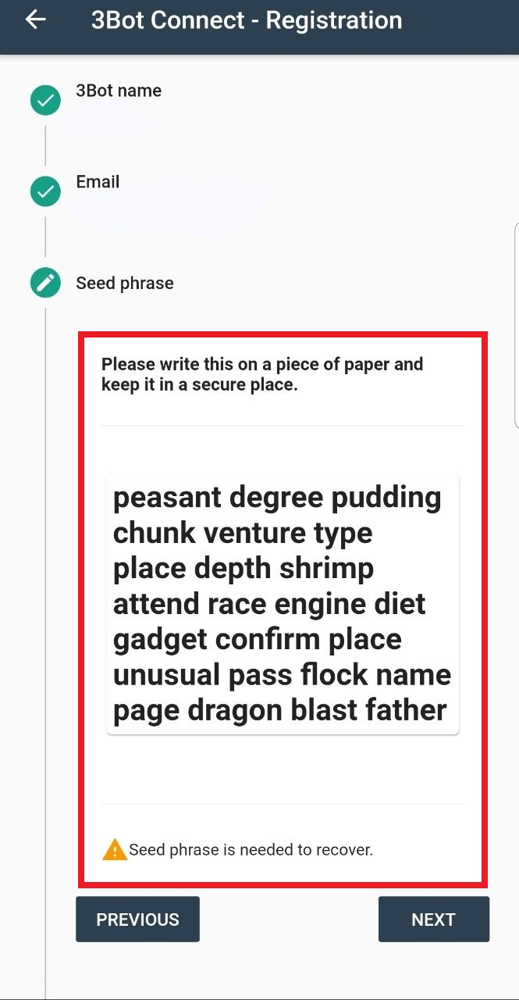

# Using the 3Bot Connect App

## Desc of 3bot

Follow the steps below to set up your 3Bot Connect wallet, and receive and send your first ThreeFold Tokens:

- [Registration and login](#st-1)
- [Home page](#hp)
- [Get your Private Key](#seed)
- [Receive tokens](#receive)
- [Send tokens](#send)
- [Transactions](#transactions)
- [Buying ThreeFold tokens using BTC-Alpha](#btc-alpha)

<a id='st-1'><a>
  
  ## Registration and login
  
  To use the 3Bot Connect App you simply need to download the 3Bot Connect App available in the Appstore or Google Play Store. Folow the steps and register using your email address.
 ### Save the seed phrase oin safety place. In the future, it is necessary to restore your wallet.

We recommend making a screenshot of this screen, print it on paper and store it safely offline.

> **3Bot does not have any access to or maintain records of your private key. It is your personal responsibility to keep your 24-word private key in a safe place.**

> **Do not share your private key with anyone, it is strictly personal. Losing your private key means losing access to your wallet and all your ThreeFold Tokens.**

> **Anybody with access to your private key can take ownership of your 3Bot Connect wallet and ThreeFold tokens**

> **To access your wallet from another wallet (on another phone or online) you will need your private key (seed), without this private key your account cannot be recovered on another device or online wallet.**

Finish this steps and choose your new pin, then confirm it and confirm your e-mail adress.

## Home Page

<a id='hp'><a>
