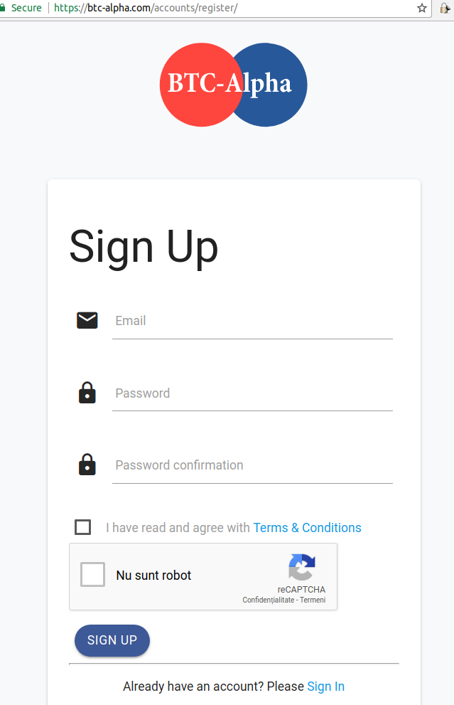
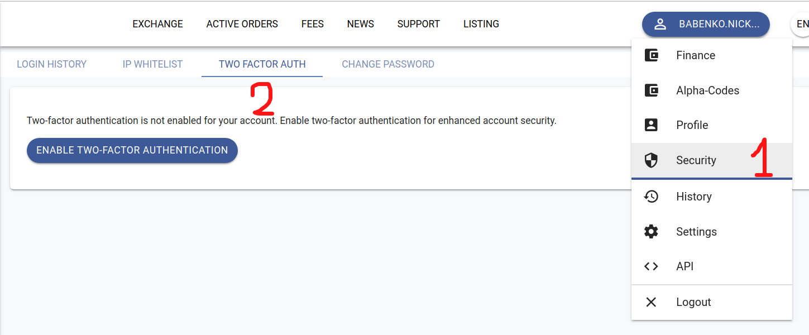
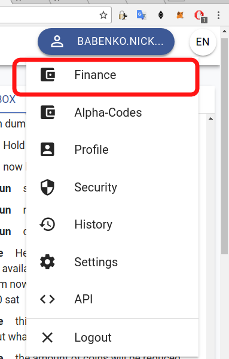

# Token Trade using BTC-Alpha

Here are the steps to follow in order to buy ThreeFold tokens using BTC-Alpha:
- [Registration](#registration)
- [Login](#login)
- [Enable two-factor authentication](#2fa)
- [Deposit BTC](#deposit-btc)
- [Exchange](#exchange-panel)
- [Buy TFT](#buy-tft)
- [Withdraw TFT](#withdraw)
- [Deposit TFT](#deposit-tft)

## Registration

Registration to the [BTC-Alpha](http://btc-alpha.com) exchange is simple, you only need to provide your email address and a password, so no complex verification procedures required. 

In order to register go to their [Sign Up](https://btc-alpha.com/accounts/register) page:

After registration, you will receive an email with an email verification link.

## Log In

Once you finished registration, log in to your account using your email address and password:

## Enable two-factor authentication

> It is not recommended to keep your funds permanently on a public exchange or use a public exchange as a wallet, because exchanges are more likely to be hacked than your personal wallet.

It is highly recommended to enable two-factor authentication (2FA) for your BTC-Alpha account.

In order to do that first install **Authy** or **Google Authenticator** on your mobile phone:
    - https://authy.com/download/
    - https://play.google.com/store/apps/details?id=com.google.android.apps.authenticator2&hl=en
    - https://itunes.apple.com/ae/app/google-authenticator/id388497605?mt=8

Then configure 2FA by go through the process on **TWO FACTOR AUTH** page:

## Deposit BTC

First we will transfer Bitcoins to your BTC wallet at BTC-Alpha, which we will then use to buy TFT.

Here are the steps to transfer Bitcoins into your BTC wallet at BTC-Alpha:

1. From the navigation menu under your profile name, go to the **Finance** section:

2. Find BTC and click **Deposit**:

3. Copy your Bitcoin address and send your deposit there:

You can use this address from any other public crypto currency exchange such as [Kraken](https://www.kraken.com) to transfer Bitcoins to your Bitcoin wallet at BTC-Alpha. If you don't own yet any Bitcoins, you should first register at one of public crypto currency exchanges such as [Kraken](https://www.kraken.com), deposit fiat money and by buy Bitcoins.

4. Wait until the transaction is fully processed, this typically takes up to 40 minutes.

## Exchange Panel

On the main screen you will see several sections:

1. List of all markets. You can type TFT to easily find TFT market. Click on it to switch onto it. 
2. Central part of the screen shows price charts and market movements. Please read more about [candlestick chart](https://www.investopedia.com/terms/c/candlestick.asp) if you want to understand better how to read the chart. 
3. Chat / Twitter / Wallets section. You can change between the three by clicking on a top panel.
4. List of all sell orders currently available on the market. Please note that price is set in BTC if you select BTC market. 
5. Window where you can put your buy order. You set amount, price, and click "Buy". You can automatically pre-populate the field by clicking on a specific SELL order. Order will be executed automatically as soon as it will match corresponding SELL order.
6. Window where you can put your sell order. You set amount, price, and click "Sell". You can automatically pre-populate the field by clicking on a specific BUY order. Order will be executed automatically as soon as it will match corresponding BUY order.
7. List of all buy orders currently available on the market. Please note that price is set in BTC if you select BTC market.
8. List of your active orders. If your order will not be matched and executed immediately, it will be visible in this section. You can cancel your standing orders at any time. 
9. List of all recent deals on the market with their price, size and date. 

## Buy TFT

1. Open main [exchange panel](#exchange-panel).
2. Click on BTC Markets in [panel 1](#exchange-panel)
3. Go to BTC-TFT Market in [panel 1](#exchange-panel)
3. Enter amount of TFT to Buy in [panel 5](#exchange-panel)
4. Enter desired price in bitcoins or pick up the price from sell orders in [panel 4](#exchange-panel)
5. Click "Buy" button.

## Withdraw TFT

> It is not recommended to keep your ThreeFold tokens permanently in an online wallet, as provided by online crypto currency exchanges such as BTC-Alpha, because online exchanges are more likely to get hacked than offline wallets. Instead we highly recommended to keep your ThreeFold tokens in an offline ThreeFold wallet, such as the one provided with the ThreeFold App.

In order to withdraw your ThreeFold tokens from your TFT wallet on BTC-Alpha go through the following steps:

1. Make sure you have the ThreeFold App installed as documented in [Token Trade using the ThreeFold App](threefold_app.md) and have the address of your ThreeFold App wallet copied, as documented in the [Receive tokens](threefold_app.md#receive) section

2. From the navigation menu under your profile name, go to the **Finance** section:

3. Locate TFT in the list and click **Withdraw**, and select TFT in the popup list (not BTC-Alpha Codes)

4. On a withdrawal dialog specify the amount of TFT to withdraw and destination address:

## Deposit TFT

Alternatively to buying TFT as documented above in [Buy TFT](#buy-tft), you can also deposit TFT from any other TFT wallet, for instance from your ThreeFold app wallet. 

Here are the steps:

1. From the navigation menu under your profile name, again go to the **Finance** section:

2. Find TFT and click **Deposit**:

3. Copy your TFT address and send your deposit there. You can scan QR code of the address from your mobile phone. Or you can just copy address through messenger for example. 

4. Send your TFT to the btc-alpha from your ThreeFold app wallet using the following address: 

5. Wait until the transaction is fully processed, this typically takes up to 40 minutes. 

